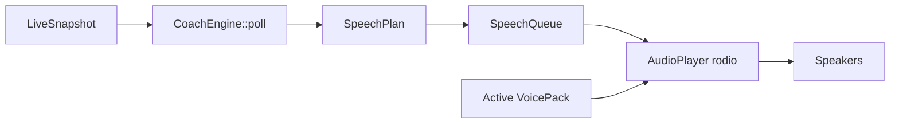

# Audio coach

The live audio coach speaks race-engineer callouts while you drive. **Runtime policy:** every word is a human recording from the active **voice pack**. There is no text-to-speech anywhere: fixed lines (flags, traffic, fuel calls) are one clip each, and numbers (lap and sector times, gaps, deltas, positions, fuel, incident counts) are composed from recorded number and glue clips. A callout whose clips the pack has not recorded yet is skipped, never synthesized.

Packs are recorded in the app's **Voice Studio** and shared as a zip or a folder. See [VOICE_PACKS.md](VOICE_PACKS.md) for the pack format, recording workflow, and sharing.

---

## Pipeline

| Module (`crates/race-refinery-audio/src/`) | Role |
|--------|------|
| `engine/` + `rules/*` | Priority logic, edge detection, session modes (`coach.rs` re-exports `RaceEngine`) |
| `speech.rs` | `SpeechPlan` / `SpeechUnit` (clip, pause, sequence); `display_text` for the UI |
| `phrasing.rs` | Composes numbers, times, fuel, and incident counts from clips |
| `phrases.rs` + `phrases.txt` | Phrase registry: every clip key, its prompt, tier (Spotter / Engineer), and category |
| `pack.rs` | `VoicePack` (load, status, save), `PackStore` (bundled + user + folder packs, resolve, create, delete) |
| `pack_io.rs` | Clone, zip export / import, import a folder of WAVs |
| `player.rs` | Renders a plan from pack clips (30 ms crossfades), built-in radio beep, missing-clip reporting |
| `record.rs` | Mic capture (cpal), take saving with one-level undo |
| `dsp.rs` | Take clean-up: resample, high-pass, trim, noise gate, normalize, fades |
| `preview.rs` | Voice Studio preview: preset callouts, composer, Spotter playlist |
| `queue.rs` | Serializes playback; one line at a time |
| `session_mode.rs` | Practice / qual / race behavior |
| `lib.rs` | `AudioCoachService` — 250 ms poll loop, status, test callout |

### Which pack plays

`audioCoachPackId` selects the pack: `default` (the bundled pack), a user pack id (a folder under `%LOCALAPPDATA%\race-refinery\voice-packs\`), or an absolute path to a linked folder pack. An unknown or unreadable reference falls back to the bundled pack with a warning in the log. The coach re-resolves the pack and volume before every callout, so switching packs in Settings or recording new clips takes effect on the next line without restarting the coach.

The bundled pack ships in `src-tauri/resources/audio/coach/default/` (bundled via `bundle.resources` in `tauri.conf.json`). At startup the host passes the resolved folder (Tauri resource dir in a packaged build, the `src-tauri` tree under `tauri dev`) to `AudioCoachService::set_clips_dir`. It is read-only in the app and holds the maintainer's recorded voice, with a clip for every registry phrase.

### Playback

A plan's clips are rendered into runs: consecutive clips and pauses are stitched into one buffer with a 30 ms linear crossfade between clips, so a composed number plays as one phrase instead of separate words. `audioCoachVolume` is applied on the sink. Coach playback and Voice Studio previews share one speak lock, so they never talk over each other.

**Missing clips:** the player skips any clip the pack lacks and logs a warning once per key. If nothing spoken is left (only the beep or pauses), the whole callout is dropped. `test_audio_coach` returns the missing keys so the UI can say what to record.

**Radio beep:** `audioRadioEffectsEnabled` plays a short two-tone chirp before each call. It is synthesized in code (a tone, not speech) unless the pack provides `radio_beep.wav`.

---

## Speech plans

- **Clip** — flags, traffic, race clock, stock fuel calls (`flag_yellow`, `pack_car_left`, `fuel_low`, …)
- **Sequence** — clips and pauses in order (typical lap: `lap` `n12` pause `n1` `minute` `n20` `n9` `point` `n5`)

`phrasing.rs` builds every number from clips:

| Value | Clips |
|-------|-------|
| 0–20, round tens | One clip (`n7`, `n15`, `n20`, `n70`) |
| 21–99 | Tens + ones (`29` → `n20` `n9`, `75` → `n70` `n5`) |
| 100+ | Digit by digit (`105` → `n1` `n0` `n5`) |
| Lap / sector time | Tenths in radio cadence: `1:29.452` → "one minute twenty-nine point five"; seconds under ten use `oh` (`1:05.3` → "one oh five point three"); under a minute there is no minute word |
| Delta | Tenths under a second (`1 tenth`, never `0 tenths`), else seconds to a tenth, then `faster` / `slower` |
| Gap | Seconds to a tenth, no trailing `.0` (`3 seconds`, `2 point 4 seconds`) |
| Position | `position` + number ("position twenty-four", shown as `P24`); after `position_up` / `position_down` just the number |
| Fuel | `fuel` + liters ("fuel twelve liters"), then `about` N `laps` `of_fuel` when the range is known |
| Fuel short | `about` N `laps` `short` |
| Incidents | `incident_intro` + count, plus `limit` + limit once within two of it |

A 180 ms pause separates a lap or sector number from its time, so "lap 20, 1 minute" is not heard as "lap twenty-one minute". `SpeechPlan::display_text` reads number clips back as digits for the UI (`[lap] 12, 1 minute 29.5`).

---

## Priority and suppression

At most **one alert per poll** (250 ms). Highest eligible priority wins; lower priorities wait for the next tick (not dropped).

| Priority | Category | Examples |
|----------|----------|----------|
| 1 | Critical | Red, checkered, black |
| 2 | Safety | Yellow (incl. waving), green, blue, incidents |
| 3 | Pack | Car left/right, three-wide, two-wide (4 s cooldown) |
| 4 | Race | Fuel-to-finish, low fuel, pit-this-lap |
| 5 | Pace | Sector/lap summaries, gap summaries |
| 6 | Strategy | Race clock, pits open, position changes |

**Pit / off-track suppression:** Pack, race, pace, gap, and strategy alerts are muted on pit road or off track. Flags and incidents still announce.

**Chatter level** (`audioCoachChatterLevel`): `minimal` trims pace/strategy; `verbose` allows more gap and pack-clear callouts.

Per-category toggles in settings: pack, flags, incidents, fuel/race, gaps, pace, strategy, race clock, pits open, pack clear.

---

## Message catalog (summary)

| Area | Triggers | Clips |
|------|----------|-------|
| Session intro | Telemetry connect | `intro_online` `intro_good_luck` |
| Flags | `SessionFlags` edges | `flag_*` |
| Incidents | `PlayerCarMyIncidentCount` increase | `incident_intro` + count (+ `limit` + limit) |
| Pack | `CarLeftRight` / `pack_state` | `pack_*` |
| Sector complete | Sector boundary cross | `sector` + number + time + deltas |
| Lap complete | Lap increment | `lap` + number + time + PB/delta/position/fuel |
| Gaps | Lap end or threshold cross | `gap_ahead` / `gap_behind` + seconds, or `gaining_*` / `losing_*` |
| Race fuel | `SessionLapsRemain` vs fuel estimate | `fuel_*` + liters / laps |
| Race clock | Time/lap milestones | `race_*` |
| Pits open | `PitsOpen` edge | `pits_open` |
| Position | Class position change at lap end | `position_up` / `position_down` + number |

Full phrase list with prompts: [`crates/race-refinery-audio/src/phrases.txt`](../crates/race-refinery-audio/src/phrases.txt).

---

## Session modes

`session_mode.rs` adjusts copy and which alerts fire:

- **Practice** — pace vs personal best emphasized
- **Qualifying** — session-best deltas on sectors
- **Race** — fuel strategy, race clock, pits open, position callouts

Session reset clears coach state when track or session type changes.

---

## How to add a new callout

1. Add the key and its spoken prompt to `phrases.txt` under the right tier and category. Spotter lines stand alone; Engineer clips are chained (numbers, glue words). Keys are part of the pack format: renaming one orphans that clip in every existing pack.
2. Implement detection in `engine/rules/<topic>.rs` and register it in the rule set.
3. Return `(SpeechPriority, SpeechPlan)`; use `SpeechPlan::sequence` for clip + numbers, building numbers with the `phrasing.rs` helpers (`push_uint`, `push_lap_time`, `push_delta`, `push_liters`, …). The `every_emitted_clip_has_a_phrase` test fails if a rule emits a key the registry lacks.
4. Wire a settings toggle in `AppSettings` + `features/live/LivePage.tsx` if needed.
5. Record the new clip in Voice Studio (it shows up as missing in every pack) and add it to the bundled pack, which `bundled_pack_records_every_phrase` requires to be complete. Document the callout here and in [COMPARISON.md](COMPARISON.md) if SDK-driven.

---

## IPC

| Command | Purpose |
|---------|---------|
| `start_audio_coach` | Start poll loop (requires live monitor) |
| `stop_audio_coach` | Stop queue and player |
| `get_audio_coach_status` | Active flag, last message, active pack id / name, Spotter and Engineer completeness |
| `get_audio_coach_message` | Last spoken line |
| `test_audio_coach` | One-shot lap callout (radio beep, `lap`, lap number + time + delta) with the active pack and volume; returns the text and any missing clip keys |

Voice pack, recording, and preview commands are listed in [VOICE_PACKS.md](VOICE_PACKS.md) and [API.md](API.md).

Auto-starts when `audioCoachEnabled` is true and live monitor starts.
